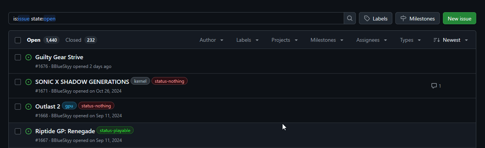
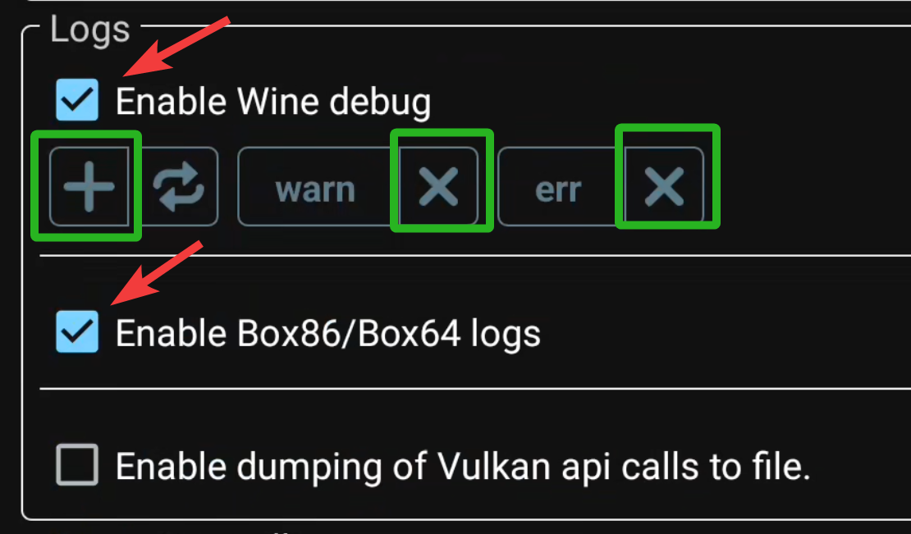
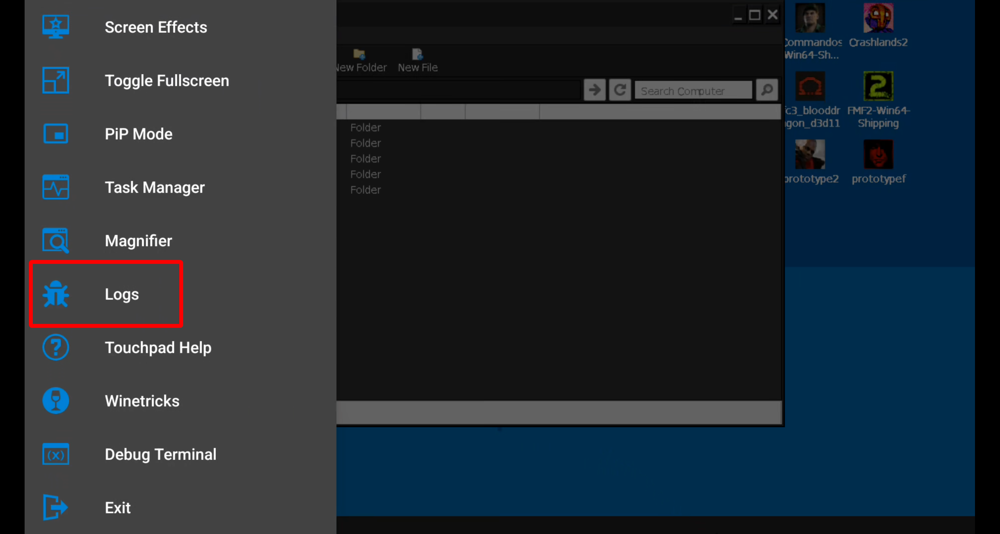

# WINLATOR 101

	  

## Your source for Winlator usage, components and more...

# 🚧 THIS REPOSITORY IS UNDER CONSTRUCTION 🚧

**This GitHub repo (<https://github.com/K11MCH1/Winlator101>) is NOT the official
source for the project `Winlator`**.   
The official Github repo is (<https://github.com/brunodev85/winlator>)

# Winlator

Winlator is an Android application that lets you run Windows applications with Wine/Proton and Box86/Box64/Box32/FEXcore.  
(depending on the version)

# Winlator versions

[Official Winlator](https://github.com/brunodev85/winlator)  
[Winlator Cmod](https://github.com/coffincolors/winlator/releases)  
[Winlator Cmod Bionic](https://github.com/jhinzuo/winlator_bionic/releases)  
[Winlator Afeimod](https://github.com/afeimod/winlator-mod/releases/)  
[Winlator Frost](https://github.com/MrPhryaNikFrosty/Winlator-Frost/releases)  
[Winlator AJAY](https://github.com/ajay9634/winlator-ajay/releases)  
[Winlator Longjunyu2](https://github.com/longjunyu2/winlator/releases) (development paused)  
[WinlatorMali](https://github.com/Fcharan/WinlatorMali/releases) (probably ceased)  

# Compatibility list  

The [Issues page](https://github.com/K11MCH1/Winlator101/issues) contains a comprehensive repository documenting GitHub Issues related to Windows applications and their compatibility status with Winlator and its various forks. It tracks regressions and improvements in a title's functionality—ranging from `nothing` to  `crash` or fully `playable` based off the `soc` and `winlator version`—while incorporating metadata for efficient retesting. 
Given the fragmentation of Android devices and the variety of existing Winlator forks, compiling this list will be a thorough process requiring users to invest some time when submitting a post. The extensive nature of the compatibility database ensures accurate tracking across different setups, helping developers and users identify critical issues and optimize performance effectively.  

# GUIDELINES

#### How do I contribute?
You can start contributing by checking if any title you want to test already has a [**issue**](https://github.com/K11MCH1/Winlator101/issues) by using the search feature: 

	  

* **If you can find one**: You can comment on the existing issue given what you see compatibility differs from the previous report.   
* **If you cannot find an existing report**: You can go ahead and [create an issue](https://github.com/K11MCH1/Winlator101/issues/new/choose) for it by filling all the details in the form.

Please make sure to add one of the following tags at the end of the title to allow us to quickly label and categorise them.
E.x: `Teardown [frost glibc]`, `Need for Speed Underground 2 [afeimod proot]`

* official glibc
* official proot
* cmod Bionic
* cmod glibc
* cmod proot
* frost glibc
* frost proot
* afeimod glibc
* afeimod proot
* ajay glibc
* ajay proot
* longjunyu
* winMali

⚠️ **Duplicate titles with the same soc and winlator version will be removed** ⚠️

#### Should I include a image/video?
As a general guideline, media should be included when it is useful to do so and provides information that cannot be conveyed via text, these guidelines serve as a rough idea of why they may be important in certain circumstances and not in others. Additionally, any media captured **must** be a direct screen capture rather than an external recording using another phone or a camera. If it is impossible to do so due to the nature of the bug, this can be ignored but generally it shouldn't be.
* **Crash**: A photo/video is generally useless in the case of a crash as the log *should* contain the crash, it may not in certain cases and we can request them in a further comment and in those cases the guidelines of a **Freeze** can be utilized.
* **Freeze**: A video is generally useful to fully understand what the bug is and in this case it should be included, it is important to show Performance Statistics by having DXVK_HUD, GALLIUM_HUD, MANGO_HUD, mesa hud or the Winlator HUD enabled in this case as it helps to determine the exact point of the freeze.
* **Auditory Glitch**: A video is useful when there are random dropouts in audio or if it doesn't sound correct, an exception is when the game is not playing any audio at all in which case there is no need to upload a image/video.
* **Visual Bug/Glitch**: At minimum, a photo is required here when the glitching is persistent. A video is useful if the glitch is very visually diverse or pops in occassionally rather than being persistent.

In general, a log is required for the aforementioned issues to enable developers to effectively proceed with troubleshooting.

#### How do I enable logs and where do I find them?

You can enable logs in the main settings of Winlator under the "Logs" category as seen in the picture below.

	  

Once enabled you can access the log menu when booted into a container:  
Note: Winlator Bionic saves logs automatically after each session, so accessing this is not required on this fork.  
Note²: You cannot save logs for crashes if you boot the game through the game shortcut.

	  

Tap on the save button on the Logs screen to save it.  
Occasionally, developers may require adjustments to these settings to obtain the relevant information they need. This can involve adding or removing variables, as indicated in the green boxes.

Winlator logs can be located in the `Interal Storage/Download/Winlator/logs`

# Resources

## Repositories

* [Wine Collection](https://github.com/K11MCH1/Winlator101/releases/tag/wine_col)
* [DXVK Collection](https://github.com/K11MCH1/Winlator101/releases/tag/dxvk_col)
* [VKD3D Collection](https://github.com/K11MCH1/Winlator101/releases/tag/vkd3d_col)
* [BOX64 Collection](https://github.com/K11MCH1/Winlator101/releases/tag/box64_col)
* [Fixes](https://github.com/K11MCH1/Winlator101/blob/main/resources/fixes.md)
* [Turnip for glibc Winlator](https://github.com/K11MCH1/WinlatorTurnipDrivers)
* [Turnip for Bionic](https://github.com/K11MCH1/AdrenoToolsDrivers)
* [AJAY's Prefix mod](https://github.com/ajay9634/Ajay-prefix/releases/tag/Ajay_prefix)
* [PtitSeb's BOX64/BOX86](https://github.com/ptitSeb/box64/actions)
* [Doitsujin's DXVK](https://github.com/doitsujin/dxvk/releases)
* [HansKristian's VKD3D](https://github.com/HansKristian-Work/vkd3d-proton/releases)

## Extras

* [BOX64 Variables](https://github.com/ptitSeb/box64/blob/main/docs/USAGE.md)
* [BOX86 Variables](https://github.com/ptitSeb/box86/blob/master/docs/USAGE.md)
* [Mesa Variables](https://docs.mesa3d.org/envvars.html#gallium-environment-variables)

# User Documentation  

* [Installation](/docs/installation.md)
* [Main Screen](/docs/main_screen.md)

## Main Settings

* Shortcuts
* Containers
* [Input Controls](/docs/input_controls.md)
* Saves
* Box64 RCFile
* Contents
* Adrenotools GPU Drivers (Winlator Bionic)
* Settings

## Container Settings

* Main Settings
* Wine Configuration
* Win Components
* Envionment Variables
* Drives
* Advanced

## Communities
### Discords
[Emugear International](https://discord.gg/6hrfu9KmcK)  
[EMUPLAY0 Gaming](https://discord.gg/54UzMKtYjA)  

### Reddit
[Winlator](https://www.reddit.com/r/winlator/)  
[EmulationOnAndroid](https://www.reddit.com/r/EmulationOnAndroid/)  

